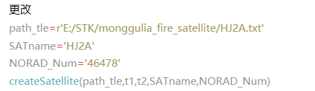
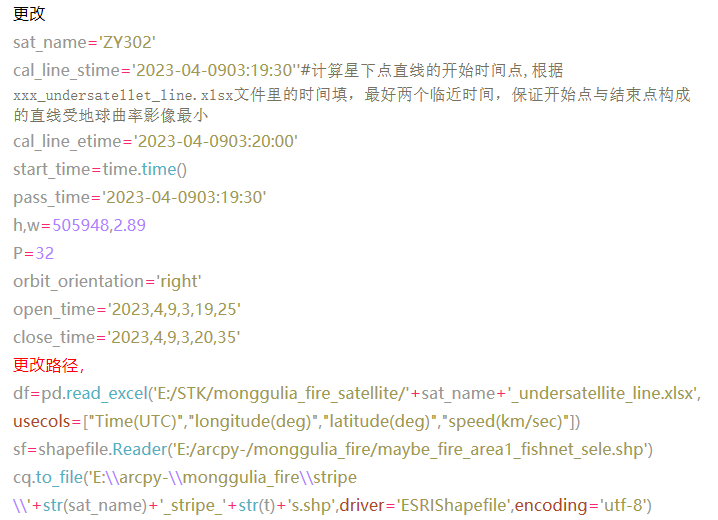
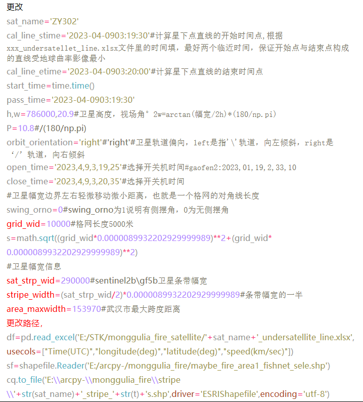
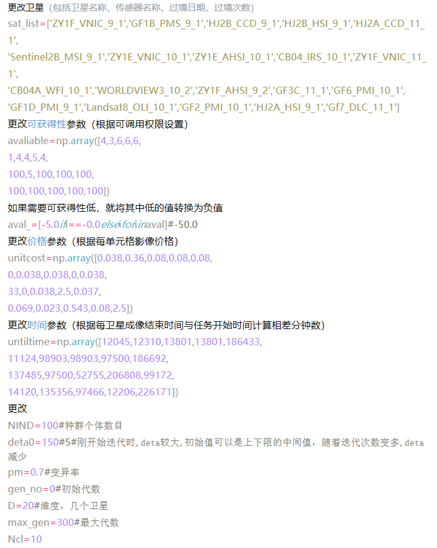
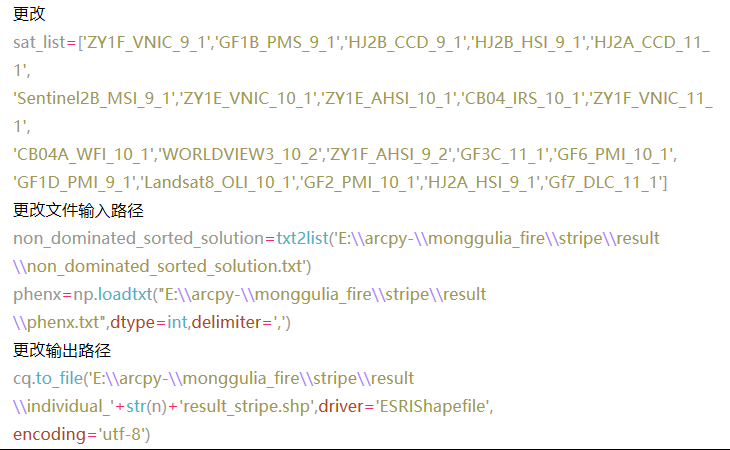

# 基于IM-NSGA2的草原火灾多星协同应急观测算法研究
The Study of IM-NSGA2 based Multi-satellite scheduling perception for grassland fire disaster

研究区域:中蒙边界，shp文件monggulia_fire.zip
卫星过境信息表：2023.4.9-4.12蒙古火灾卫星资源.xls
实验所用卫星资源库中卫星的两行根数，在monggulia_fire_satellite文件夹中

## 流程：
###　step0:卫星条带生成，打开No0_create_orbit.py

###　step1:格网化研究区，打开 No1_get_fishnet.py

###　step2:生成成像条带，分成带偏转角与不带偏转角
带偏转角的卫星，打开No2_basetimeANDdeclination_get_stripe.py

不带偏转角的卫星，打开No2_noswing_get_stripe.py

对全覆盖的卫星，打开No2_get_all_covered_stripe.py
###　step3:IM-NSGA2算法计算卫星组合，打开No3_mult_IA_Geatoy_new_ava.py

###　step4:求出的组合合成一个shp文件，打开No4_result2shp.py

